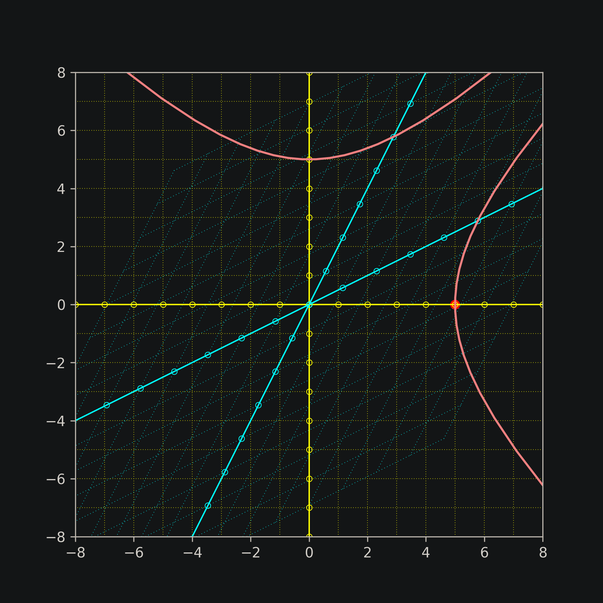

# Minkowski Space-time
Utilities for drawing space-time [Minkowski diagrams](https://www.feynmanlectures.caltech.edu/I_17.html) in Python.
Transformation can also be set to Galilean in order to check differences wih Lorentz / SR effects.



### How-to
```python
gh clone alelouis/minkowski-spacetime
```

```python
pip3 install numpy matplotlib
python3 main.py
```

### References
- https://www.feynmanlectures.caltech.edu/I_17.html